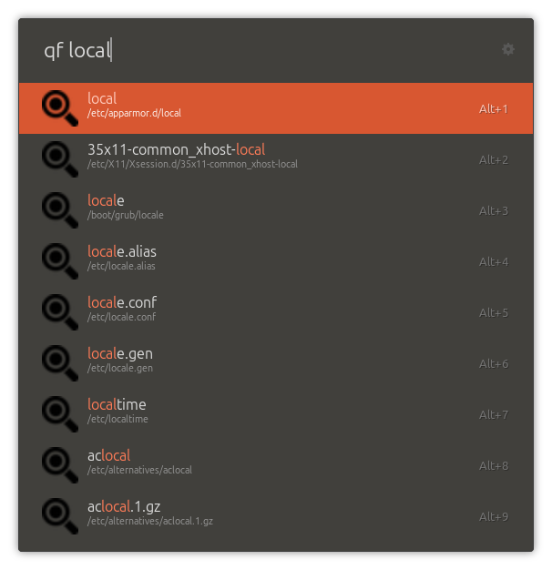
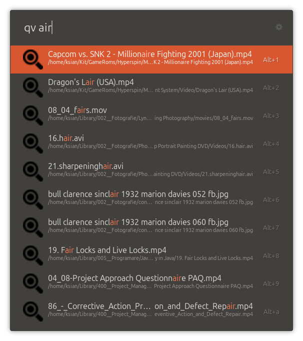
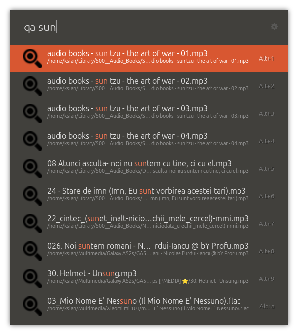
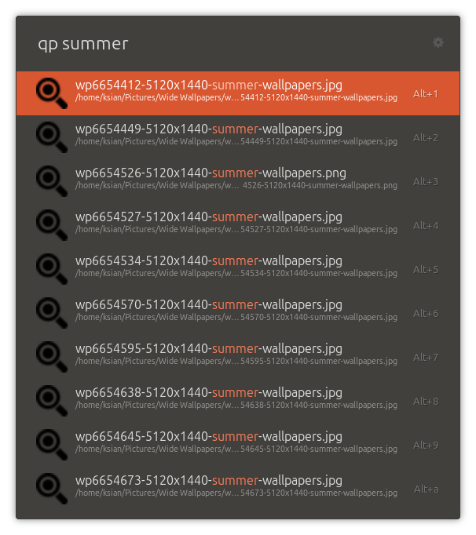

# 🔍 QuickLocate for Ulauncher

**Quick Locate** is a blazing fast Ulauncher extension that helps you **quickly find files, folders, and more** on your computer — all from your keyboard.

It knows these keywords:
1. qf for generic files
2. qa for audio files
3. qp for pictures
4. qv for videos
5. qdir for folders

---

## Features

- Find files and folders instantly using plocate
- Supports custom search directories
- Lightweight and fast
- Smart fuzzy matching
- Designed for Linux based on plocate

---

## Preview

---

##  Installation
There are no requirements when it comes to python packages.

### Requirements

- [Ulauncher](https://ulauncher.io/)
- [plocate](https://plocate.sesse.net/)

### Steps

1. Open Ulauncher.
2. Go to **Settings > Extensions > Add extension**.
3. Paste the URL of this github page: https://github.com/ksiansf/Ulauncher-quickfind-plocate
